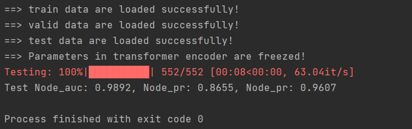

# Multi-AD

This repository contains the code implementation of Multi-AD for graph anomlay detection. 

## Dataset Sources
当然，以下是将你所使用的六个数据集来源、论文引用及**具体下载链接**整合为一个**简洁清晰的完整段落**，适合直接写入 `README.md` 或论文补充材料：

---

We conduct experiments on six publicly available real-world graph datasets, each covering diverse domains such as social networks, Q\&A communities, healthcare claims, cryptocurrency transactions, and review-based trust graphs:

* The sources and usage of the [Reddit](https://snap.stanford.edu/data/soc-redditHyperlinks.html) dataset can be found on [snap.stanford.edu](https://snap.stanford.edu/data/soc-redditHyperlinks.html), as introduced in [Kumar *et al*., 2019](https://arxiv.org/abs/1902.07243). It contains a user interaction graph with edges denoting hyperlink relationships. The data can be downloaded from:

  * [https://snap.stanford.edu/data/soc-redditHyperlinks-title.tsv.gz](https://snap.stanford.edu/data/soc-redditHyperlinks-title.tsv.gz)
  * [https://snap.stanford.edu/data/soc-redditHyperlinks-body.tsv.gz](https://snap.stanford.edu/data/soc-redditHyperlinks-body.tsv.gz)

* The sources and usage of the [Question](https://github.com/serranoqm/gadbench/tree/main/data/Question) dataset can be found in the [GADBench GitHub repository](https://github.com/serranoqm/gadbench), as described in [Platonov *et al*., 2024](https://arxiv.org/abs/2402.12847). It is a Q\&A forum graph with textual and structural features. The dataset is available at:

  * [https://github.com/serranoqm/gadbench/tree/main/data/Question](https://github.com/serranoqm/gadbench/tree/main/data/Question)

* The sources and usage of the [Heal-Fraud](https://github.com/Graph-COM/HEAL) dataset can be found on the [HEAL project GitHub](https://github.com/Graph-COM/HEAL), as introduced in [Ma *et al*., 2023](https://arxiv.org/abs/2308.07873). It consists of healthcare insurance claims connected by shared attributes. The data can be accessed at:

  * [https://github.com/Graph-COM/HEAL/tree/main/Heal-Data](https://github.com/Graph-COM/HEAL/tree/main/Heal-Data)

* The sources and usage of the [Elliptic](https://www.kaggle.com/datasets/ellipticco/elliptic-data-set) dataset can be found on [kaggle.com](https://www.kaggle.com/datasets/ellipticco/elliptic-data-set), as introduced in [Weber *et al*., 2019](https://arxiv.org/abs/1908.02591). It is a Bitcoin transaction graph used for anti-money laundering research. The dataset is available at:

  * [https://www.kaggle.com/datasets/ellipticco/elliptic-data-set](https://www.kaggle.com/datasets/ellipticco/elliptic-data-set)

* The sources and usage of the [Amazon (Musical Instruments)](http://deepyeti.ucsd.edu/jianmo/amazon/categoryFilesSmall/Musical_Instruments.json.gz) dataset can be found on the [Amazon Review Dataset website](https://nijianmo.github.io/amazon/index.html), as described in [McAuley *et al*., 2013](https://cseweb.ucsd.edu/~jmcauley/pdfs/sna2013.pdf). It includes user reviews and TF-IDF features. The dataset can be downloaded from:

  * [http://deepyeti.ucsd.edu/jianmo/amazon/categoryFilesSmall/Musical\_Instruments.json.gz](http://deepyeti.ucsd.edu/jianmo/amazon/categoryFilesSmall/Musical_Instruments.json.gz)

* The sources and usage of the [Epinions](https://www.cse.msu.edu/~tangjili/trust.html) dataset can be found on [Tang’s trust network project page](https://www.cse.msu.edu/~tangjili/trust.html), and are also included in [GADBench](https://arxiv.org/abs/2306.12251) by \[Tang *et al*., 2023]. It is a trust-oriented user review graph. The dataset can be downloaded from:

  * [https://www.cse.msu.edu/\~tangjili/data/trust.tar.gz](https://www.cse.msu.edu/~tangjili/data/trust.tar.gz)

---

如果你还需要这段文字转换成 `.md` 文件、LaTeX 段落、BibTeX 文献引用，或者希望附上每个数据集的统计信息（如节点数、边数、标签比例等），我也可以继续为你生成。


Place the obtained datasets into the `./datasets` folder for subsequent testing and training.


## Installation
Ensure you have `Python=3.10` and `PyTorch=1.13.1` installed on your system. You can install the required packages using the following command:

```python
pip install -r requirements.txt
```

## Preparing Data
Before training the model, you need to preprocess the data. The `preprocess.py` is designed to handle this step. Run the script as follows:
```python
python preprocess.py
```

This script will process the raw data and prepare it for training and testing.

## Model Training
To train the Multi-AD model, set the mode argument to train and run the `main.py` script:
```python
python main.py --mode train
```

Ensure you have configured the necessary parameters and data paths in the script or through a configuration file.

## Model Testing
After training the model, you can test its performance by setting the mode argument to test and running the `main.py` script:
```python
python main.py --mode test
```

This will evaluate the trained model on your test dataset and provide performance metrics.

## Result
The following shows the test results of the Weibo dataset:



